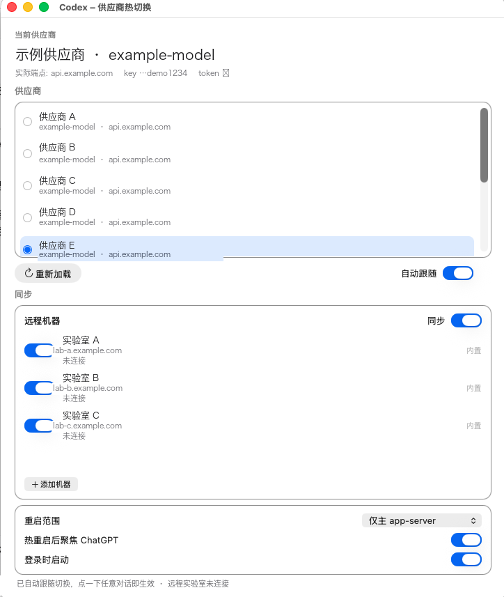

# codex-hotswitch

个人小工具仓库 [tools](https://github.com/coderWang404/tools) 里的第一个工具。在不重启 Codex 应用的前提下，热切换 cc-switch 管理的第三方模型供应商。

- **桌面 App**：`Codex 热切换.app`（原生菜单栏/窗口应用，内置全部逻辑，双击即用）
- **命令行版**：`codex-hotswitch` CLI（适合脚本/终端用户）



## 它解决什么问题

用 cc-switch 切换 Codex 供应商后，正在运行的 Codex 仍在使用旧供应商，必须重启才生效：

- **模型选择器**里还是旧供应商的模型列表（模型目录在 app-server 启动时就固定了）；
- **已经开着的对话**仍然把请求发往旧供应商；
- 只有"新建对话"会读到新配置，但模型选择器是过期的，体验割裂。

本工具在切换配置后，**只重启 Codex 的 app-server 子进程**（不是重启 ChatGPT 应用）。
ChatGPT 应用会自动拉起新的 app-server，从而一次性刷新：模型目录 + 所有对话 + 鉴权配置。

## 桌面 App（推荐）

在仓库根目录时，先进入 `codex-hotswitch/`。下面的命令都在这个目录里执行。

```bash
# 构建（需要 macOS 命令行工具，已自带 swiftc）
./build-app.sh

# 运行
open "dist/Codex 热切换.app"

# 安装到应用程序目录（推荐，登录启动功能依赖标准路径）
cp -R "dist/Codex 热切换.app" /Applications/
```

界面说明：

| 区域 | 功能 |
| --- | --- |
| 当前供应商 | **以 `config.toml`（Codex 真正读取的文件）为准**显示正在使用的卡片、实际端点、key 尾号、token 校验 |
| 一致性提示 | 若某张卡片的配置内容被改成了别的端点（卡片名与实际不一致），或有多张卡片内容重复，会在底部明确提示 |
| 供应商列表 | **单击任意供应商即完成热切换**（当前项有蓝色圆点）；每行都显示该卡片的实际端点主机名 |
| ♻ 重新加载 Codex | 在 cc-switch 界面切换后点它，Codex 立即生效 |
| ⚡ 自动跟随 | 开启后，你在 cc-switch 里一切换，App 自动热重启 Codex |
| 重启范围 | 仅主 app-server / 含 computer-use 会话 / 全部 |
| ☑ 热重启后聚焦 ChatGPT | 聚焦会触发应用立即拉起新 app-server，切换即时生效 |
| ☐ 登录时启动 | 开机自动常驻，配合自动跟随最省心 |

> 关于菜单栏图标：macOS 菜单栏图标数量有限（尤其带刘海的机型），
> 当菜单栏没有空位时系统会隐藏新图标。此时 App 主窗口 + Dock 图标仍可正常使用。
> 想要菜单栏快捷入口，可以先退出一个不常用的菜单栏图标再启动本 App。

## 命令行版

要求：macOS + Node.js ≥ 18 + cc-switch + Codex。无需 npm install（零依赖，只用系统自带的 `sqlite3`/`ps`）。

```bash
# 方式一：直接跑
node bin/codex-hotswitch.mjs list

# 方式二：注册全局命令
npm link

codex-hotswitch list                    # 列出所有 codex 供应商（● = 当前）
codex-hotswitch current                 # 查看当前供应商 + 实际生效配置 + 运行中的 app-server
codex-hotswitch switch <名称或 ID>       # 切换供应商并热重启 Codex（核心命令）
codex-hotswitch reload                  # 只热重启（在 cc-switch 界面切换后用这个）
codex-hotswitch watch                   # 常驻监控：cc-switch 里一切换就自动热重启（推荐）
codex-hotswitch sync-remote             # 把本机供应商同步到远程，并重启远程 app-server
codex-hotswitch remote-status           # 查看远程正在使用的供应商和密钥尾号
codex-hotswitch doctor                  # 环境自检
```

常用选项：

| 选项 | 说明 |
| --- | --- |
| `--scope chatgpt` | 默认。只重启 ChatGPT 应用的主 app-server |
| `--scope chatgpt-all` | 包含 computer-use 会话的 app-server |
| `--scope all` | 包含 Trae/Windsurf 等其它应用的 codex app-server |
| `--hard` | 跳过平滑退出，直接强制结束（界面会出现「Restart ChatGPT」恢复页，点一次即恢复） |
| `--drain <秒>` | SIGTERM 平滑等待时间，默认 8 秒 |
| `--no-reload` | 只写配置，不重启 Codex |
| `--dry-run` | 只展示将要写入的配置 / 将要重启的进程 |
| `--no-focus` | 热重启后不把 ChatGPT 窗口切到前台 |
| `--json` | 输出 JSON（桌面 App 与脚本调用） |

## 切换后会发生什么

1. `~/.codex/config.toml` 被原子写入（原文件自动备份为 `config.toml.bak_<时间戳>`）；
2. 若该供应商配置了模型目录，`~/.codex/cc-switch-model-catalog.json` 同步更新；
3. Codex 的 app-server 收到 SIGTERM，平滑退出（有任务在跑时最多等 `--drain` 秒，然后强制结束）；
4. **ChatGPT 应用无需重启**：聚焦/点击 ChatGPT 即触发应用自动拉起新 app-server，供应商立即生效；
5. 终端里的 `codex` CLI 会话不受影响，但它们需要**自行重启**才会生效（会提示数量）。

## 原理（为什么不用重启应用）

实测与源码确认的 Codex 行为：

- app-server 每次 `thread/start` 都会**重新读取** `config.toml`，所以新对话本来就能拿到新供应商；
- 但**模型目录（model/list）**和**已有对话的运行时配置**都在 app-server 启动时固定，无法在运行中刷新；
- 因此"换供应商"必须换 app-server 进程，而不是换配置文件；
- app-server 收到 SIGTERM 会**优雅退出（exit code 0）**，ChatGPT 应用检测到干净退出后不会报错，
  在下一次需要 app-server 时（激活窗口/点击对话）自动重新拉起它 —— 这就是"不重启应用"的关键；
- 本工具复刻了 cc-switch 写入 `config.toml` 的完整流程（通用配置合并 → bearer token 注入 →
  模型目录生成），并用一次性 app-server 实例校验后再切换，保证与 cc-switch 原生产物一致。

## 与 cc-switch 的协作方式（重要）

**推荐工作流：在 cc-switch 里切换供应商 + 本 App 开「自动跟随」。** 两边状态永远一致，不会出问题。

原因：cc-switch 有一个「离开某张卡片时，把当前 config.toml 回填进那张卡片」的机制。
如果外部工具（本工具/手工编辑）在 cc-switch 不知情的情况下改了 config.toml，
cc-switch 可能把这份配置回填到"它以为的当前卡片"，造成**卡片名与卡片内容错位**。

因此本工具加了保护：

| 场景 | 行为 |
| --- | --- |
| cc-switch 正在运行 + 命令行 `switch` | **默认拒绝**并提示改用 cc-switch 界面（要强制需 `--force`） |
| cc-switch 正在运行 + App 里点供应商行 | 弹窗提示，默认引导「打开 cc-switch」，可选强制切换 |
| 同步 cc-switch 状态失败 | 显式告警（不再静默） |
| 界面显示 | 始终展示「cc-switch 记录 vs 实际生效」，错位一眼可见 |

另外：用 `CODEX_HOME` 指定其它配置目录时，本工具不会写入 cc-switch 状态。

## 兼容性说明

- **官方 OpenAI 供应商**（ChatGPT 登录态走 `auth.json`）：请用 cc-switch 界面切换，然后用 `reload`；
  本工具不代写官方登录态，避免破坏你的 ChatGPT 凭据。
- **终端 CLI（codex TUI）**：TUI 的运行中会话无法热刷新，重启该终端会话即可。
- cc-switch 升级后如果改变了配置写法，本工具会因校验失败而报错并保留备份，可用备份随时回滚。

## 远程同步

打开「自动跟随」和「远程同步」后，在 cc-switch 里切换供应商，本机会热重启，并把供应商、模型、端点和密钥同步到已启用的远程机器，同时重启那些机器上当前 SSH 账号的 Codex app-server。

机器在界面里添加，保存在本机 `~/.codex-hotswitch/remotes.json`。登录走 `~/.ssh/config` 里的用户和密钥，不要把地址、账号或密码写进仓库。`src/remotes.json` 默认是空列表。

```json
{
  "disabled": [],
  "hosts": [
    { "label": "实验室 A", "host": "lab-a.example.com", "user": "me", "enabled": true }
  ]
}
```

同步只替换决定请求去向的字段。远程自己的项目路径、桌面设置和 MCP 保持不动。

## 目录结构

```
bin/codex-hotswitch.mjs   CLI 入口（--json 供 App 调用）
src/ccswitch-db.mjs       读取/同步 cc-switch SQLite
src/switcher.mjs          切换编排（生成配置 → 校验 → 写入 → 同步）
src/toml-edit.mjs         bearer token 注入 / catalog 字段管理
src/common-config.mjs     通用配置片段的合并与剥离
src/catalog.mjs           模型目录生成（移植自 cc-switch）
src/verify-client.mjs     一次性 app-server 校验
src/reloader.mjs          app-server 发现 + 平滑重启
src/watcher.mjs           watch 模式
src/remote-sync.mjs       远程供应商同步
src/remotes.json          内置远程机器（默认空）
docs/screenshot.png       界面演示图
src/templates/            cc-switch 的模型目录模板（vendored）
app/                      桌面 App（Swift / AppKit）
tools/make-icon.swift     图标生成
build-app.sh              一键构建 .app
dist/Codex 热切换.app      构建产物
```
